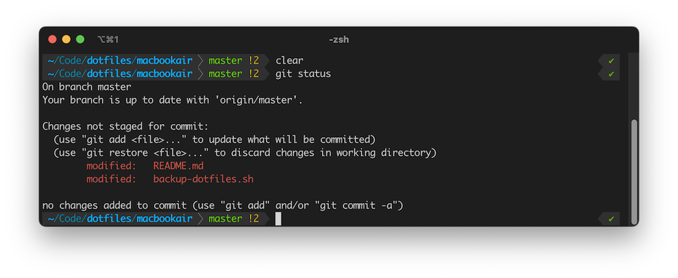

# Macbook Air M1 Dotfiles

**🚨Run `backup-dotfiles.sh` every now and then!🚨


## Managing Dotfiles


I chose not to symlink paths.
Instead, the [`backup-dotfiles.sh`](backup-dotfiles.sh) script copies dotfiles from `~/` to this repository.
Then I use `git` to manage this repository.

Manually copy files back to your homedirectory to install. 

To add more files to backup, modify the config in [`backup-dotfiles.sh`](backup-dotfiles.sh).

| Action           | Method |
| ---------------- | ------ |
| Backup Dotfiles  | `./backup-dotfiles.sh` then `git commit -am "<message>"` |
| Restore Dotfiles | Manually copy from this directory |
| Add Dotfiles     | Edit config in [`backup-dotfiles.sh`](backup-dotfiles.sh). |


# Running Notes

## 2024.07.01  Big Update 👈

After taking a new job at StackAV where I was asked to do more IC work, 
I spent time reconfiguring my terminal and vim.

### Password, Secrets, and SSH Keys Management

🚨 **I migrated off LastPass and onto 1Password.** 🚨

One of the cool things is that 1Password installed an `ssh-agent` and lets you manage your SSH Keys!

#### 2FA App

I actively use a *different* app for 2FA than my Password Manager. 
I use Authy from Twilio for 2FA on my phone.

I believe it is **less secure** is the same app stores your password and your 2FA code. 
That is no longer two factor authentication, if you compromise 1Pass then you're in everywhere!
With my setup, an attacked would have to compromise both LastPass and Authy to gain access.

### Fonts

I went down a rabbithole on [nerd fonts](https://www.nerdfonts.com/).
In the end, I concluded that the simple fonts are the best ones, really.

Visual Studio Code does a really fancy auto-line-spacing algorithm that provides nice spacing for long coding runs. 
Everywhere else, you get the default line spacing. 
Menlo is a tightly line-spaced font which is nice for terminal. 
MesloLGM is a Menlo variable with Medium line spacing (the "M" at the end of the name).

My preferred fonts are:

- Terminal and Text Editor: [Menlo for Powerline](https://github.com/lxbrtsch/Menlo-for-Powerline)
- Alternative for Text Editor: Monaco, the build-in Mac font. Softer and more organic than Menlo.
- Alternative for Terminal: MesloLGS Nerd Font, same as Menlo with bigger line spacing and all the glyphs.

Fonts are vailable in the [fonts](./fonts/) directory.

This is the Meslo nerdfont:


### iTerm2

You have to configure iTerm2 to send Esc+ for Option keys, found in ` Profiles > Keys`


### ZSH, P10k and oh-my-zsh

**See [zshrc](zshrc) file**



MacOS default shell is `zsh` so I'm going with that.

For custom prompts, there's the venerable [powershell10k](https://github.com/romkatv/powerlevel10k) and the new kid [starship.rs](https://starship.rs/). I tried both and Powerlevel10k is faster, while Starship is buggy and the documentation is often incorrect. So, P10K it is. Just did the default config here.

*✨Now we start to get [fancy](https://dev.to/abdfnx/oh-my-zsh-powerlevel10k-cool-terminal-1no0):✨*

#### oh-my-zsh 
First, install oh-my-zsh
```
sh -c "$(curl -fsSL https://raw.github.com/robbyrussell/oh-my-zsh/master/tools/install.sh)"
```
Then, check out the `.zshrc` and `.zshrc.pre-oh-my-zsh` and make sure you're happy with your new config.

#### p10k prompt
Then, we install the p10k theme.

```
git clone https://github.com/romkatv/powerlevel10k.git $ZSH_CUSTOM/themes/powerlevel10k
```

And edit our `.zshrc` config to set the theme correctly:

```
# Disable the standard robbyrussell theme from oh-my-zsh
#ZSH_THEME="robbyrussell" 
# Enable p10k
ZSH_THEME="powerlevel10k/powerlevel10k"
```

I have P10k already configured in `.p10k.zsh` so right out of the box it works. 


#### zsh-syntax-highlighting plugin

```
git clone https://github.com/zsh-users/zsh-syntax-highlighting.git ${ZSH_CUSTOM:-~/.oh-my-zsh/custom}/plugins/zsh-syntax-highlighting
```

#### zsh-autosuggestions plugin

```
git clone https://github.com/zsh-users/zsh-autosuggestions ${ZSH_CUSTOM:-~/.oh-my-zsh/custom}/plugins/zsh-autosuggestions
```

#### enable plugins in .zshrc

Edit the `.zshrc` file to have this line:
```
plugins=( git zsh-syntax-highlighting zsh-autosuggestions )
```

### Sublime Text 4 Enhancements

I do still use and love Sublime Text for how lightweight and great it is. 
At my last 3 jobs, everyone is using Visual Studio Code and there's a lot of good stuff in there, and that's my daily driver for work, but Sublime still is in my toolbelt.

Plugins:

- Markdown Extended
- MarkdownPreview
- MarkdownLivePreview


## 2021.08.18

* Homebrew is native on Mac M1
	* https://code2care.org/howto/install-homebrew-brew-on-m1-mac
	* `/bin/bash -c "$(curl -fsSL https://raw.githubusercontent.com/Homebrew/install/HEAD/install.sh)"`
* youtube-dl the manual way

## 2021.05.20

* Sublime Text 4 for M1 Mac!


## 2021.03.25

* PrivateInternetAccess (rosetta)
* Evernote (rosetta)

## 2021.03.23

Useful Website to find M1 apps.
* [isitapplesiliconready.com](https://isapplesiliconready.com/)
* [doesitarm.com](https://doesitarm.com/)


Useful fonts: 
* https://github.com/powerline/fonts
* MesloLG Nerd Font [preview](https://www.programmingfonts.org/#meslo) [download](https://github.com/ryanoasis/nerd-fonts/releases/download/v3.2.1/Meslo.zip)


### Applications Installed

* Brave Browser
* Google Chrome
* Loopback Audio
	* Had to Enable System Extensions. Shut down computer, power on into Startup Security Utility, enable Kernel Extensions.
	* `Name: Niels Joubert`
	* `Code: VADS-RU2E-AQNY-3HFD-FGW8-YEMU-KWHP-VGE2-XBQJ`
* Rectangle app
* iStatMenus 6
	* `Email: njoubert@gmail.com`
	* `Key: GAWAE-FCPBJ-JNK34-SA32X-G2K3Y-YZEXB-VT4G2-AM3QC-CRJX5-FHVPT-33DVC-HDQ6L-BAD3G-SKSZR-W2AA`
* Apple Developer Tools (type `git` in the command line and it pops up the installer)
* VSCode
* iTerm2
	* set colors to `vscode-iterm`
	* Install Menlo for Powerline, set font pt 14
* VLC
* Setup SSH Keys for Github
	* https://docs.github.com/en/enterprise-server@3.0/github/authenticating-to-github/generating-a-new-ssh-key-and-adding-it-to-the-ssh-agent
		

