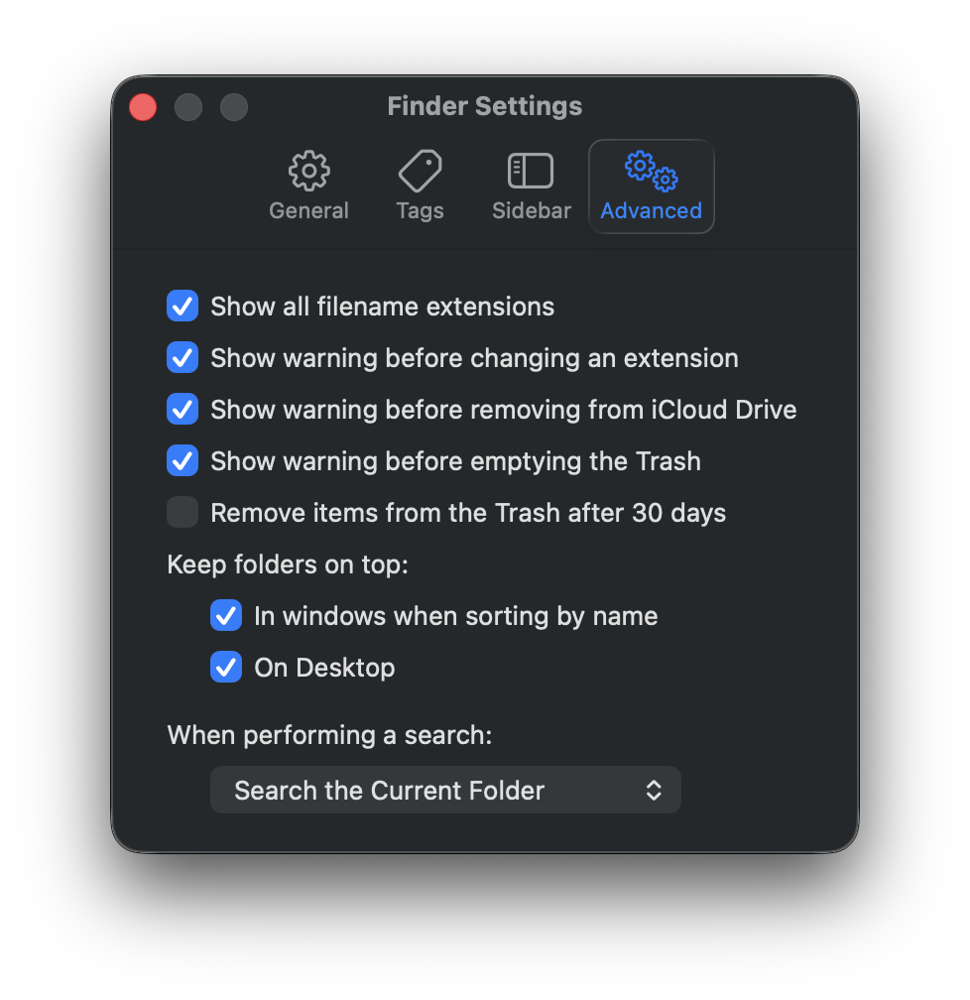

# Macbook Air M4

```text
15-inch, M4, 2025
32 GB RAM 
1 TB SSD
F4WXPNHWP7
```

Purchased second hand. 
Arrived on October 24th.

Replaced Top Plate on April 16th after Kombucha Spill

## Sane Finder Settings

Set finder to:

* Show all filename extensions
* Keep folders on top, in windows and on desktop


