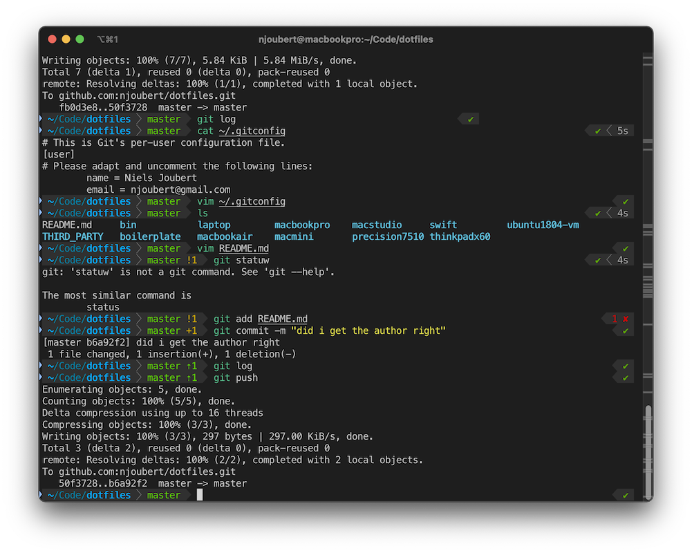

# Macbook Pro M4 Max Dotfiles

Much of the work here is based on the [Macbook Air dotfiles in this repo.](../macbookair/README.md)

# Running Notes

## 2025-02-16 

General Apps Installed:
* Brave Browser
* 1Password
* Rectangle App
* Alfred
* iStat Menus 7
* IINA
* Grand Perspective

Developer-specific Apps Installed:
* Apple Developer Tools - simply type "git" in the command line
* XCode in the App Store
* Sublime Text 4

Developer-specific CLI Apps:
* brew
* `brew install exiftool imagemagick`

Photography-specific Apps Installed:
* Adobe Lightroom Classic, Photoshop, Lightroom
* Polarr Pro Photo editor (from the App Store)

### 1Password SSH Agent

Follow the official instructions [here](https://developer.1password.com/docs/ssh/get-started/). 
Now we can ssh to my servers and github using 1password.

### iTerm2 with my profile and colors.



I love iTerm2, but it needs some better colors and profiles.

* [Download](https://iterm2.com/downloads.html) and install as usual.
* Set as default terminal
* Load the profile from [njoubert-iterm2-profile.json](../macbookair/njoubert-iterm2-profile.json)
* Also load the vscode-iterm colors from [vscode-iterm.itermcolors](../macbookair/vscode-iterm.itermcolors)

### ZSH and co

I'm duplicating the ZSH setup from my macbook air by following [these instructions]((../macbookair/README.md)

### Sublime Text 4

First we install [sublime text 4](https://www.sublimetext.com/download)

I want the handy `subl` cli shortcut described here.
To install `subl` we update `.zshrc` with this snippet:

```bash
############## START SUBLIME TEXT #################
# 2025.02.19 NIELS
#
export PATH="/Applications/Sublime Text.app/Contents/SharedSupport/bin:$PATH"
############## END SUBLIME TEXT #################
```

### brew
